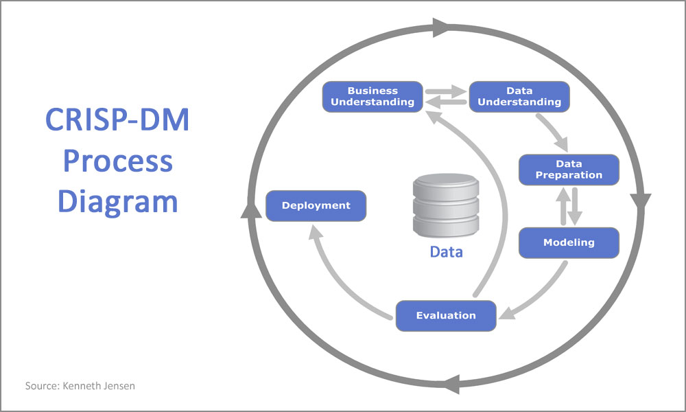

#  Previsão de Crimes - Recife


## 1 - Descrição do projeto 

Um projeto de análise de dados e machine learning para previsão de crimes na região metropolitana do Recife, com foco em análise exploratória e modelagem preditiva baseada em dados históricos de ocorrências policiais.


## 2 - Problema do negócio e objetivo do projeto


Em **março de 2025**, aproximadamente **R$ 300 mil em drogas** foram apreendidas no Centro de Tratamento de Encomendas dos Correios em Recife, evidenciando:

- **Rota interestadual**: SP → Recife → Interior do Nordeste
- **Sofisticação criminosa**: Uso de encomendas disfarçadas

Isso fez com que a policia ficasse preocupada e queria resolver e diminuir o trafico de drogas nos bairros de recife.

Considerando isso, os objetivos do projeto são : 

- identificar insights de crimes em padrões sazonais.
- construir um modelo capaz de prever a ocorrência de crimes por bairro e período temporal, contribuindo para estratégias de segurança pública mais eficazes e alocação otimizada de recursos policiais.
- Mostrar os resultados de crimes previstos e estrátegias de combate-lo.


## 3 - Estrutura do Projeto


```
Previsao_crimes/
│
├── 📁 app/                                          # Backend da aplicação
│   ├── __init__.py                                  # Inicializador do pacote Python
│   ├── main.py                                      # API FastAPI - servidor principal
│   ├── clustering.py                                # Endpoints do modelo de clustering (K-Means)
│   ├── supervisionado.py                            # Endpoints do modelo supervisionado (predição)
│   └── 📁 models/                                   # Modelos treinados e metadados
│       ├── modelo_clustering.pkl                    # Modelo K-Means serializado
│       ├── modelo_supervisionado.pkl                # Modelo HistGradientBoosting serializado
│       ├── bairros_clusters.csv                     # Mapeamento de bairros para clusters
│       └── cluster_stats.csv                        # Estatísticas de cada cluster
│
├── 📁 data/                                         # Diretório de dados
│   ├── 📁 raw/                                      # Dados brutos originais
│   │   └── dataset_ocorrencias_delegacia_5.csv      # 5.002 ocorrências criminais (2022-2025)
│   └── 📁 processed/                                # Dados processados
│       └── dados_processados.csv                    # Dataset com features engenheiradas
│
├── 📁 notebooks/                                    # Jupyter Notebooks para análise
│   ├── EDA.ipynb                                    # Análise Exploratória de Dados completa
│   ├── modelling_supervisionado.ipynb               # Desenvolvimento do modelo de regressão
│   └── modelling_naosupervisionado.ipynb            # Desenvolvimento do clustering K-Means
│
├── 📁 Pipeline/                                     # Scripts de automação
│   └── train_modelo_supervisionado.py               # Pipeline de retreino do modelo
│
├── 📁 frontend/                                     # Interface web React
│   ├── 📁 public/                                   # Arquivos públicos estáticos
│   │   └── diagnostico.html                         # Página de diagnóstico do sistema
│   ├── 📁 src/                                      # Código-fonte React
│   │   ├── main.jsx                                 # Entry point da aplicação React
│   │   ├── App.jsx                                  # Componente raiz da aplicação
│   │   ├── index.css                                # Estilos globais com Tailwind
│   │   ├── 📁 components/                           # Componentes reutilizáveis
│   │   │   └── Layout.jsx                           # Layout padrão da aplicação
│   │   ├── 📁 pages/                                # Páginas da aplicação
│   │   │   ├── Dashboard.jsx                        # Dashboard principal com métricas
│   │   │   ├── ClusteringAnalysis.jsx               # Análise de agrupamento de bairros
│   │   │   ├── PredictionAnalysis.jsx               # Predições supervisionadas
│   │   │   └── MapView.jsx                          # Visualização geográfica (Leaflet)
│   │   └── 📁 services/                             # Serviços externos
│   │       └── api.js                               # Cliente HTTP para comunicação com API
│   ├── index.html                                   # HTML principal da SPA
│   ├── package.json                                 # Dependências e scripts Node.js
│   ├── vite.config.js                               # Configuração do Vite (build tool)
│   ├── tailwind.config.js                           # Configuração do Tailwind CSS
│   └── postcss.config.js                            # Configuração do PostCSS
│
├── 📁 teste/                                        # Scripts de testes da API
│   ├── test_api_clustering.py                       # Testes dos endpoints de clustering
│   ├── test_api_predicao.py                         # Testes dos endpoints de predição
│   └── fix_models_teste.py                          # Script de correção de modelos
│
├── 📁 venv/                                         # Ambiente virtual Python (não versionado)
│
├── 📄 requirements.txt                              # Dependências Python do projeto
├── 📄 README.md                                     # Documentação principal do projeto
└── 📄 .gitignore                                    # Arquivos ignorados pelo Git
```


## 4 -  explicação do Dataset

O dataset contém **5.002 registros** de ocorrências policiais com as seguintes características:

### Variáveis Principais:
- **`data_ocorrencia`**: Data e hora da ocorrência
- **`bairro`**: Localização (Boa Viagem, Imbiribeira, Santo Amaro, etc.)
- **`tipo_crime`**: Categorias (Homicídio, Roubo, Furto, Sequestro, etc.)
- **`descricao_modus_operandi`**: Método utilizado no crime
- **`arma_utilizada`**: Tipo de arma (Arma de Fogo, Faca, Objeto Contundente, etc.)
- **`quantidade_vitimas`**: Número de vítimas
- **`quantidade_suspeitos`**: Número de suspeitos
- **`sexo_suspeito`** e **`idade_suspeito`**: Perfil demográfico
- **`orgao_responsavel`**: Delegacia responsável

### Período Coberto:
**2022 - 2025** (dados incluem projeções futuras para validação do modelo)

## 5 Tecnologias Utilizadas

### Backend:
- **Python 3.11+**
- **FastAPI** - Framework web moderno e rapido
- **pandas 2.0.3** - Manipulacao de dados
- **numpy 1.26.0** - Computacao numerica
- **scikit-learn 1.3.0** - Machine learning
- **matplotlib 3.7.2** - Visualizacao
- **seaborn 0.12.2** - Visualizacao estatistica

### Frontend:
- **React 18** - Framework JavaScript
- **Vite** - Build tool rapida
- **Leaflet** - Mapas interativos
- **Recharts** - Graficos e visualizacoes
- **Tailwind CSS** - Estilizacao moderna
- **Axios** - Cliente HTTP

### Modelos de Machine Learning:
- **K-Means Clustering** - Agrupamento de bairros por risco
- **RandomForestRegressor** - Modelo baseline
- **HistGradientBoostingRegressor** - Modelo principal


## 5 -Pipeline da solução e  Metodologia ultilizada 

O seguinte pipeline foi utilizado, baseado na estrutura CRISP-DM

1. Compreensão empresarial.
2. Compreensão de dados.
3. Preparação de dados.
4. Modelagem.
5. Avaliação.
6. Implantação.

Estrutura CRISP-DM



Metodologia 

### 1. Análise Exploratória de Dados (EDA)
- Distribuição temporal dos crimes
- Análise por bairro e tipo de crime
- Padrões sazonais e tendências
- Correlações entre variáveis
- Visualizações interativas

### 2. Processamento de Dados
- Limpeza e tratamento de dados faltantes
- Engenharia de features temporais (lags)
- Criação de variáveis agregadas por bairro/mês
- Normalização e encoding de variáveis categóricas

### 3. Modelagem Preditiva
- **Problema**: Regressão para prever número de crimes por bairro/mês
- **Variável Target**: Quantidade de crimes agregada
- **Features**: Dados históricos, sazonalidade, características do bairro

### 4. Avaliação
- **Métricas**: MAE (Mean Absolute Error), RMSE, R²
- **Validação**: Train/test split temporal
- **Comparação**: RandomForest vs HistGradientBoosting


## 6- Como Executar

### Backend (API)

```powershell
# Instale as dependencias Python
pip install -r requirements.txt

# Rode a API
uvicorn app.main:app --reload --port 8000
```

API disponivel em: `http://localhost:8000`
Documentacao: `http://localhost:8000/docs`

### Frontend (React)

```powershell
# Entre na pasta do frontend
cd frontend

# Instale as dependencias
npm install

# Rode o frontend
npm run dev
```

Frontend disponivel em: `http://localhost:5173`

### Guia Completo
Para instrucoes detalhadas, consulte: **`COMO_RODAR_COMPLETO.md`**

## API REST

O projeto inclui uma **API completa** para consumo dos modelos via requisições HTTP:


#### **Predição (não supervisionado)**


**Endpoints:**
- `GET /clustering/` - Lista todos os bairros e clusters
- `POST /clustering/predict` - Prediz cluster de um bairro
- `GET /clustering/clusters/info` - Informações dos clusters
- `GET /clustering/bairros/ranking` - Ranking dos bairros

#### **Predição (Supervisionado)**


**Endpoints:**
- `GET /predicao/` - Informações do modelo
- `POST /predicao/predict` - Prevê crimes para um bairro
- `POST /predicao/predict/multiplos` - Prevê para múltiplos bairros
- `GET /predicao/historico/{bairro}` - Histórico de crimes

## Licença

Este projeto está sob a licença MIT. Veja o arquivo `LICENSE` para mais detalhes.


<div align="center">
  <strong> Dados • Machine Learning •  Segurança Pública •  API REST</strong>
  
  **[Documentação da API](GUIA_API.md)** | **[Notebooks](notebooks/)** | **[Dataset](data/raw/)**
</div>